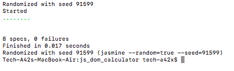

# Sparta Calculator

the aim of this work is to build a basic calculator by using the DOM object in javascript.

### Requirements
* The calculator will carry put basic operations
* values to be added must be shown before the operator is given
* result of any given operation must be displayed at the main screen at top.

### Jasmine - test basic functions
* this project will use jasmine for a TDD approach.
* Rquires
  * node.js
  * jasmine

#### My approach
I've created 4 functions that do the basic calculations: add, subtract, divide and multiply. I then used them in another function called calculation.
calculation function takes 3 parameters: first is a number, second is an operator and third is the second number. Depending on the operator passed. the calculation function will chose the right function and run it with the two other argument.
